<a href="https://github.com/BPower0036/BPower0036/">
  </img>
</a>

I'm BPower0036. I develop things, because I want them better then other people have done it.  
I live in the [Netherlands/Holland](https://www.openstreetmap.org/relation/2323309#map=5/51.154/9.712). If you want, you can talk English, Dutch and even German to me. I understand it all.  
And you're the </img>th visitor of this page.
</img>

## Developer for Fun
- 🔭 I’m currently working on: [EasyDutch](https://github.com/EasyDutch-uBO/EasyDutch/)
- 🌱 I’m currently learning everything I come along and want to do different or nicer.
- 🤔 I’m looking for help with solving nothing.😂
- 💬 Ask me about anything I maybe can know.
- 📫 How to reach me: Make an issue on my GitHub pages or start [here a Discussion](https://github.com/BPower0036/BPower0036/discussions)
- 😄 Pronouns: He/Him.
- 😄 Suffix: BA.
- ⚡ Fun fact: Everything done on my GitHub repro's I have learned myself without any prior coding knowledge.
- [My GitHub UnWrapped](https://www.githubunwrapped.com/BPower0036) / [From 2022](https://user-images.githubusercontent.com/80090789/211824788-51e04065-2655-4df8-9a60-28734554b597.mp4)

  </img>
  </img>
<table align="center">
  <tr>
    <td align="center" width="50%">
      </img>
    </td>
    <td align="center" width="50%">
      </img>
      <tr>
    </td>
  </tr>
  <tr>
    <td align="center" width="50%">
      </img>
    </td>
    <td align="center" width="50%">
       
    </td>
  </tr>
  <tr>
    <td  align="center" width="50%">
      </img>
      <!-- </img> -->
    </td>
    <td  align="center" width="50%">
       </img>
    </td
  </tr>
  <tr>
    <td align="center">
        </img> 
    </td>
    <td align="center">
        </img>
    </td>
  </tr>
  <tr>
    <td align="center" colspan="2">
      </img>
    </td>
  </tr>
  <tr>
    <td align="center" colspan="2">
      </img>
    </td>
  </tr>
  <tr>
    <td align="center" colspan="2">
       </img>
    </td>
  </tr>
  <tr>
    <td align="center" colspan="2">
      </img>
      

Full history
</img>

    </td>
  </tr>
</table>

<a href="https://www.paypal.com/donate/?hosted_button_id=NRARDMBBMV3LC">
  </img>
</a>
